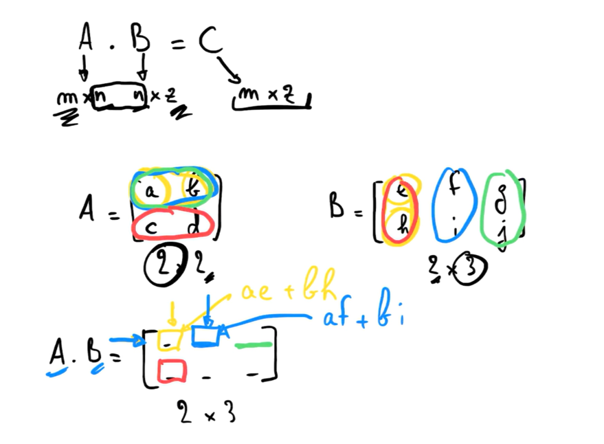

# Matrices et numpy

## Introduction

Qu'est ce qu'une matrice?

Une matrice est un tableau de nombres disposés en lignes et en colonnes. Elle est souvent utilisée pour représenter des données ou des équations. Elles permettent d'effectuer des opérations communes sur un grand nombre de données (qui en général ont tous un lien en commun) de manière très efficace.

Exemple: une image

Une image est une matrice de pixels. Chaque pixel est un nombre qui représente une couleur. Les images en noir et blanc sont des matrices à deux dimensions. Les images en couleur sont des matrices à trois dimensions.

Si on veut changer la luminosité d'une image, sans matrice on devrait changer la valeur de chaque pixel un par un. Avec les matrices, on peut changer la valeur de tous les pixels en une seule opération.

Numpy est une bibliothèque de calcul python qui permet de faire des opérations sur les matrices de manière très efficace.

Une matrice avec m lignes et n colonnes est de dimension m x n.

exemple: une matrice de dimension 3x2

```python
[[1, 2],
 [3, 4],
 [5, 6]]
```

## Création de matrices

Pour créer une matrice avec numpy, on utilise la fonction `array` de numpy.

```python
import numpy as np

matrice = np.array([[1, 2],
                    [3, 4],
                    [5, 6]])

matrice.shape # (3, 2)
```

## Opérations sur les matrices

### Transposée

La transposée d'une matrice est obtenue en échangeant les lignes et les colonnes.
Comme si on traçait un miroir sur la diagonale (de haut à gauche à bas à droite).

```python

matrice = np.array([[1, 2],
                    [3, 4],
                    [5, 6]])
matrice.shape # (3, 2)

transposée = matrice.T # [[1, 3, 5],
                       #  [2, 4, 6]]

transposée.shape # (2, 3)
```

### Addition

Pour additionner deux matrices, elles doivent avoir la même dimension. Le résultat est une matrice de la même dimension que les deux matrices d'origine.

On addition les éléments de même position.

exemple:

```python
matrice1 = np.array([[1, 2],
                    [3, 4],
                    [5, 6]])
matrice2 = np.array([[7, 8],
                    [9, 10],
                    [11, 12]])
matrice1 + matrice2 # [[8, 10],
                    #  [12, 14],
                    #  [16, 18]]
```

### Produit

Pour faire le produit entre A et B, il faut autant de colonnes dans A que de lignes dans B.

```text
A . B = C
(m x n) . (n x p) = (m x p)
```

Il faut que les "n" correspondent.
Donc si A est de dimension m x n, B doit être de dimension n x p. L'ordre des matrices est important. On ne peut pas faire B . A car on aurait (n x p) . (m x n).



exemple:

```python
A = np.array([[1, 2],
              [3, 4],
              [5, 6]])

B = np.array([[7, 8],
              [9, 10]])

C = A.dot(B) # [[25, 28],
              #  [57, 64],
              #  [89, 100]]

C.shape # (3, 2)

```
