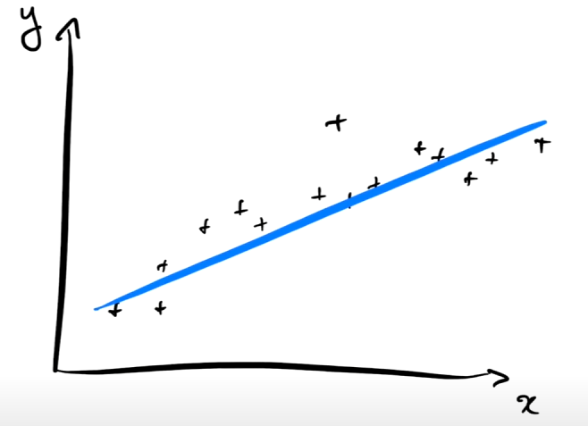
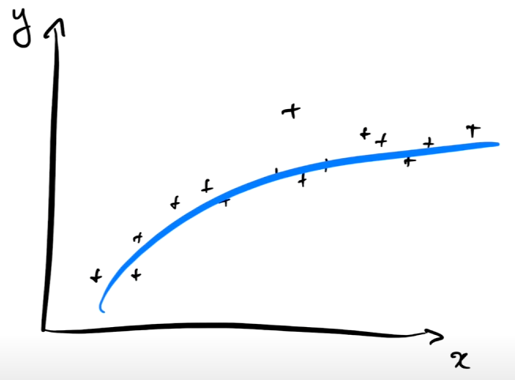
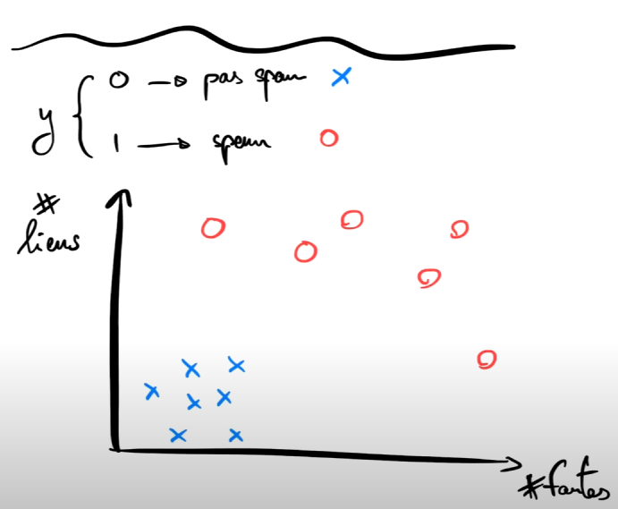
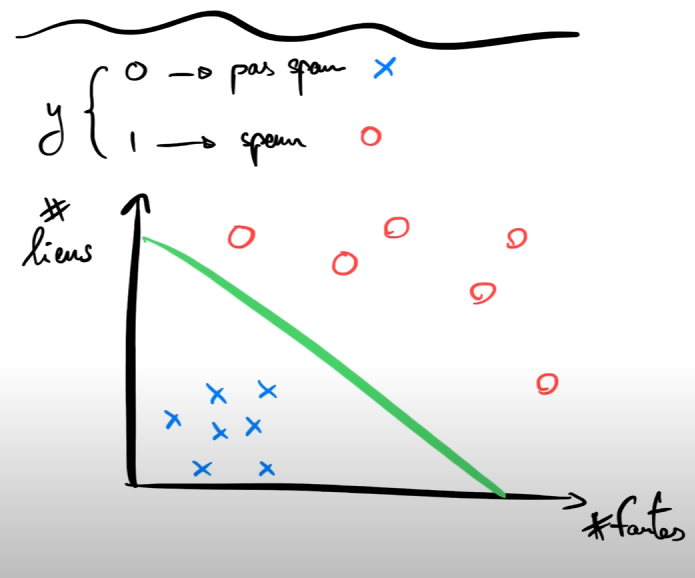

# Présentation

## Qu'est ce que le machine learning ?

### Définition

C'est donner à une machine la capacité d'apprendre sans la programmer explicitement.

### Cas d'usage

- Reconnaissance d'image
- Reconnaissance de la parole
- Prédiction de séries temporelles
- ...

### Comment est ce que les humains apprennent ?

A partir d'exemples non supervisés:

- Un enfant apprend à reconnaître un chien en voyant des chiens
- Un enfant apprend à parler en écoutant les autres parler

A partir d'exemples supervisés:

- Un professeur montre à un élève des exemples de chiens
- Un professeur montre à un élève comment prononcer des mots

### Comment est ce que les machines apprennent ?

#### A partir d'exemples supervisés

On joue le rôle de professeur. On donne à la machine des exemples pour créer un "Modèle". Ces exemples sont regroupés dans un tableau de données appelé "Dataset".

## Modèles

Imaginons un tableau de données où nous avons une colonne X et une colonne Y et on veut que la machine cherche la relation qui lie X à Y.
Le tableau de données va ressortir un nuage de points à partir duquel la machine pourra apprendre un modèle `Linéaire` ou `Polynomial` ou `...` qui lie X à Y.

### Modèle linéaire: Y = aX + b

### Modèle polynomial: Y = aX^2 + bX + c

---

## Types de problèmes dans l'apprentissage supervisé

### Régression

On cherche à prédire une valeur continue (variable qui peut avoir une infinité de valeur).

Exemple: Prédire le prix d'une maison en fonction de sa surface.

### Classification

On cherche à prédire une valeur discrète (variable qui peut avoir un nombre fini de valeur).

Exemple: Prédire si un email est un spam ou non.

#### Exemple schema

La frontière de décision est la ligne qui sépare les deux classes.

