# Régression Linéaire

Pour la fonction coût, on utilise la `norme euclidienne`.

On prends la moyenne des erreurs au carré. On rajoute un facteur 1/2 pour faciliter les calculs.
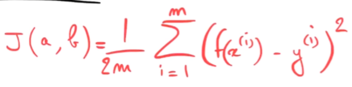

Cette fonction coût porte le nom de `Mean Squared Error` (MSE) ou `Erreur Quadratique Moyenne` (EQM).

Méthode des moindres carrés:
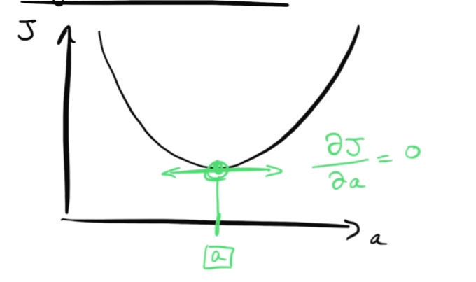

Elle implique de faire des inversions de matrices pour obtenir la version de A optimale directement. C'est très coûteux en temps de calcul.
Pour résoudre ce problème, on utilise la méthode de la descente de gradient.

## Descente de gradient

Elle fonctionne pour les courbes de coût `convexes`. (une seule solution optimale)

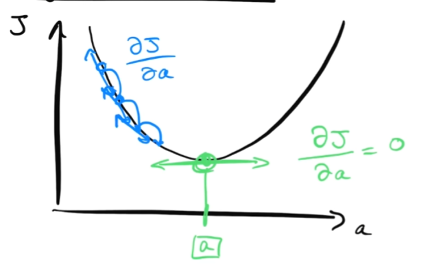

Cette méthode va permettre de converger vers la valeur de A optimale.

On commence par prendre un paramètre A aléatoire. On va ensuite le modifier petit à petit pour minimiser la fonction coût.

Pour calculer la pente, on calcule la `dérivée partielle` de J(A, B) par rapport à chaque paramètre.

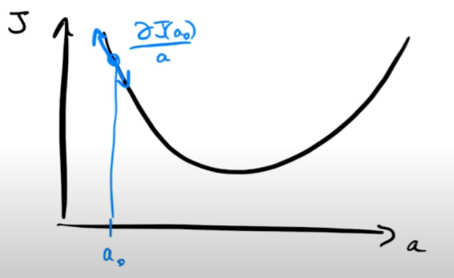

Alpha (α, Learning rate) est le taux d'apprentissage. C'est le pas que l'on va faire pour descendre la pente. Il définit la `vitesse de convergence` de l'algorithme. On dit que c'est un `hyperparamètre`.

On avance de -α \* dérivée partielle pour chaque paramètre. On répète cette opération jusqu'à ce que la pente soit nulle.

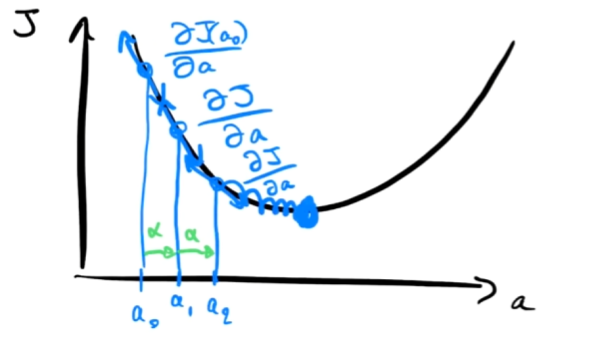

La formule de la descente de gradient est la suivante:
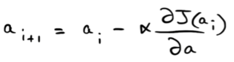

### Explication de la formule

- A est le vecteur des paramètres du modèle
- α est le taux d'apprentissage (Il est toujours positif)
- ∇J(A) (A i+1) est le vecteur des dérivées partielles de J(A) par rapport à chaque paramètre

Pour le cas où on se trouve du côté décroissant de la courbe de coût, la dérivée partielle est négative. On avance donc dans le bon sens.
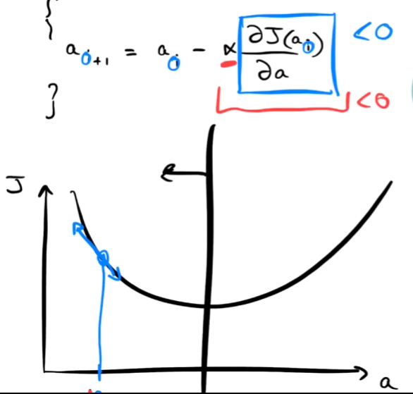

Pour le cas où on se trouve du côté croissant de la courbe de coût, la dérivée partielle est positive. On avance donc dans le sens inverse.
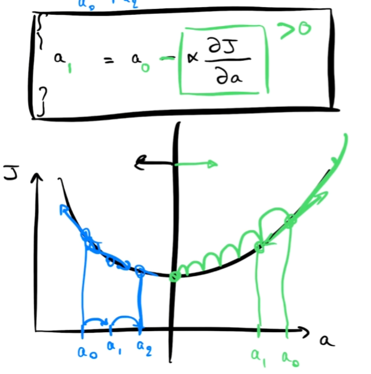

## L'importance du taux d'apprentissage

Si le taux d'apprentissage est trop petit, la descente de gradient va converger très lentement.

Si le taux d'apprentissage est trop grand, la descente de gradient peut ne pas converger du tout.
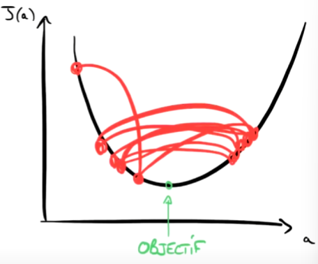

## Calcul du gradient

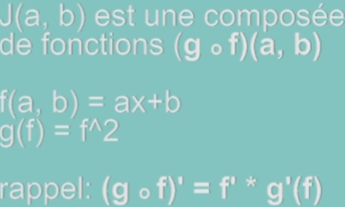

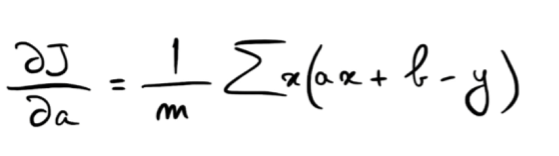

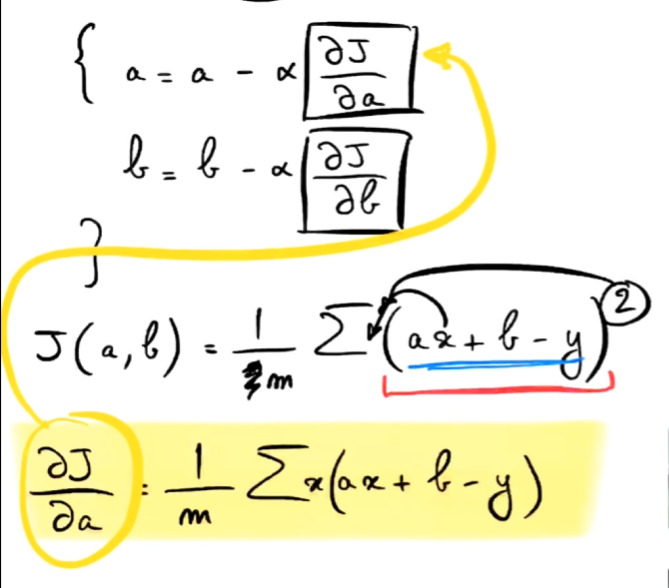

## Résumé

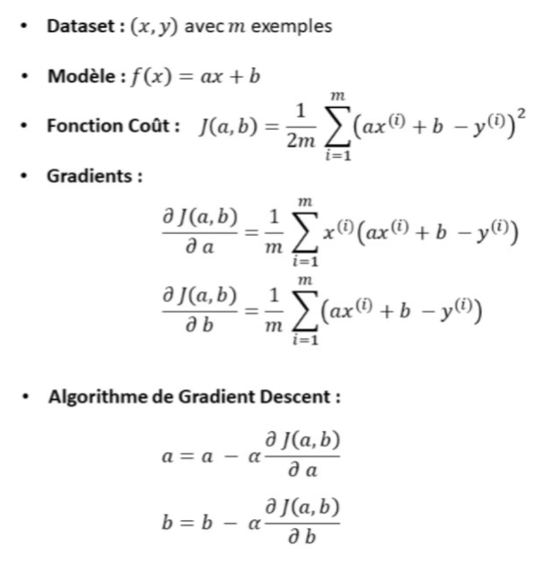
