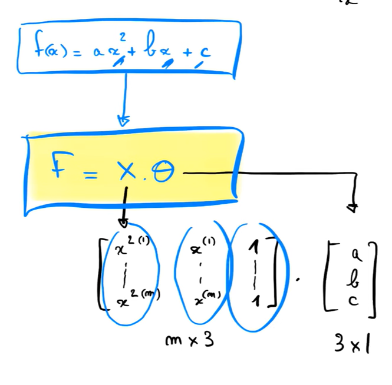

# Régression linéaire multiple

Pour faire une régression linéaire multiple, on utilise la même méthode que pour la régression linéaire simple. La seule différence est que la matrice X contient plus d'une colonne.

Chaque colonne de la matrice X représente une variable indépendante.

Theta est un vecteur de paramètres. Chaque paramètre est associé à une variable indépendante. (a, b, c, ...)

